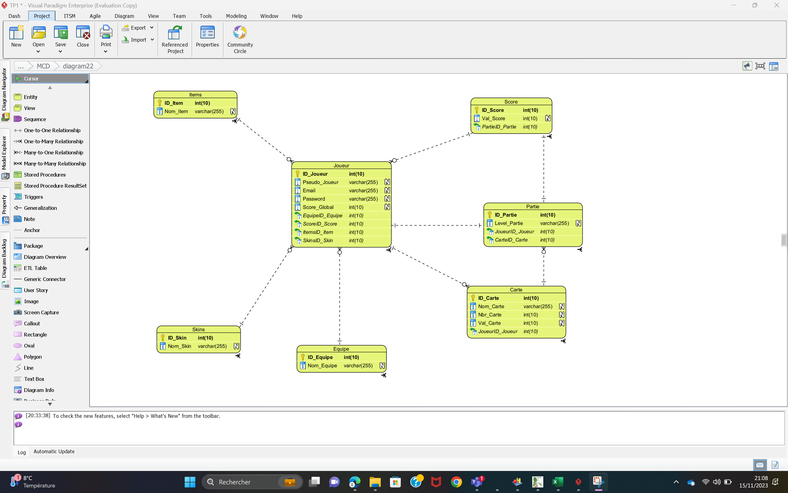
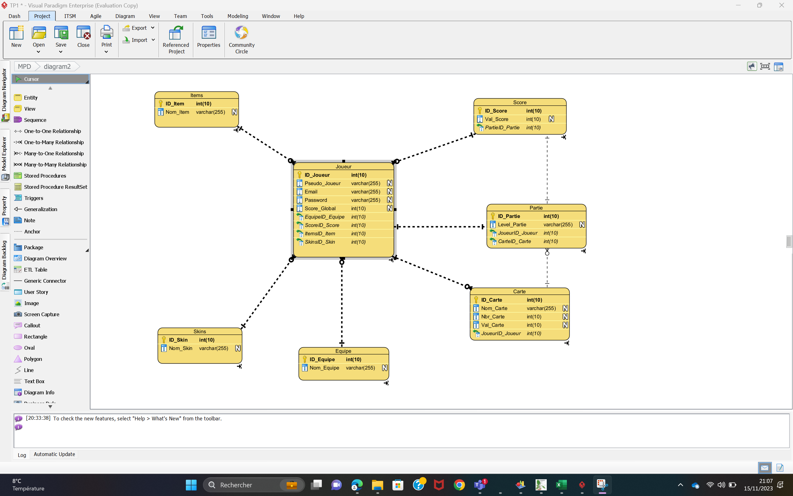

# db-conception

# Binome: Chaimae Boukanzia , Gueye Mbaye

### Enoncé
Vous êtes mandaté pour créer une base de données pour les serveurs d'un jeu vidéo tel que Fall Guys, Among Us ou Golf With Your Friends. Si l'inspiration vous manque, faites au plus simple.

Un jeu nécessite l'enregistrement de joueurs, d'un certain nombre de parties, éventuellement différentes cartes sur lesquelles les parties se déroulent, un score par partie, et un score global permettant d'établir un classement entre joueurs. Les joueurs peuvent éventuellement disposer de skins ou d'items particuliers, et potentiellement être en équipe avec d'autres joueurs.

Concevez cette dernière, étape par étape, en suivant les précèptes de la méthode MERISE. Documentez votre travail en expliquant chacune des étapes de la conception et assurez-vous que votre travail complet soit consultable.

Points d'attention

Votre travail consistera en la conception et la modélisation des étapes suivantes :

dictionnaire des données
MCD
MLD
MPD
script SQL
Décrivez chaque étape et faites des captures d'écrans si cela peut vous simplifier la documentation.

### dictionnaire des Données
### MCD 


### MPD 


### MLD 


### SQL

```SQL
CREATE TABLE Carte (
  ID_Carte        int(10) NOT NULL AUTO_INCREMENT, 
  Nom_Carte       varchar(255), 
  Nbr_Carte       int(10), 
  Val_Carte       int(10), 
  JoueurID_Joueur int(10) NOT NULL, 
  PRIMARY KEY (ID_Carte));
CREATE TABLE Equipe (
  ID_Equipe  int(10) NOT NULL AUTO_INCREMENT, 
  Nom_Equipe varchar(255), 
  PRIMARY KEY (ID_Equipe));
CREATE TABLE Items (
  ID_Item  int(10) NOT NULL AUTO_INCREMENT, 
  Nom_Item varchar(255), 
  PRIMARY KEY (ID_Item));
CREATE TABLE Joueur (
  ID_Joueur       int(10) NOT NULL AUTO_INCREMENT, 
  Pseudo_Joueur   varchar(255), 
  Email           varchar(255), 
  Password        varchar(255), 
  Score_Global    int(10), 
  EquipeID_Equipe int(10) NOT NULL, 
  ScoreID_Score   int(10) NOT NULL, 
  ItemsID_Item    int(10) NOT NULL, 
  SkinsID_Skin    int(10) NOT NULL, 
  PRIMARY KEY (ID_Joueur));
CREATE TABLE Partie (
  ID_Partie       int(10) NOT NULL AUTO_INCREMENT, 
  Level_Partie    varchar(255), 
  JoueurID_Joueur int(10) NOT NULL, 
  CarteID_Carte   int(10) NOT NULL, 
  PRIMARY KEY (ID_Partie));
CREATE TABLE Score (
  ID_Score        int(10) NOT NULL AUTO_INCREMENT, 
  Val_Score       int(10), 
  PartieID_Partie int(10) NOT NULL, 
  PRIMARY KEY (ID_Score));
CREATE TABLE Skins (
  ID_Skin  int(10) NOT NULL AUTO_INCREMENT, 
  Nom_Skin varchar(255), 
  PRIMARY KEY (ID_Skin));
ALTER TABLE Joueur ADD CONSTRAINT FKJoueur975527 FOREIGN KEY (EquipeID_Equipe) REFERENCES Equipe (ID_Equipe);
ALTER TABLE Carte ADD CONSTRAINT FKCarte185112 FOREIGN KEY (JoueurID_Joueur) REFERENCES Joueur (ID_Joueur);
ALTER TABLE Partie ADD CONSTRAINT FKPartie238422 FOREIGN KEY (JoueurID_Joueur) REFERENCES Joueur (ID_Joueur);
ALTER TABLE Joueur ADD CONSTRAINT FKJoueur576353 FOREIGN KEY (ScoreID_Score) REFERENCES Score (ID_Score);
ALTER TABLE Joueur ADD CONSTRAINT FKJoueur627176 FOREIGN KEY (ItemsID_Item) REFERENCES Items (ID_Item);
ALTER TABLE Joueur ADD CONSTRAINT FKJoueur813631 FOREIGN KEY (SkinsID_Skin) REFERENCES Skins (ID_Skin);
ALTER TABLE Score ADD CONSTRAINT FKScore329814 FOREIGN KEY (PartieID_Partie) REFERENCES Partie (ID_Partie);
ALTER TABLE Partie ADD CONSTRAINT FKPartie248057 FOREIGN KEY (CarteID_Carte) REFERENCES Carte (ID_Carte);

```

